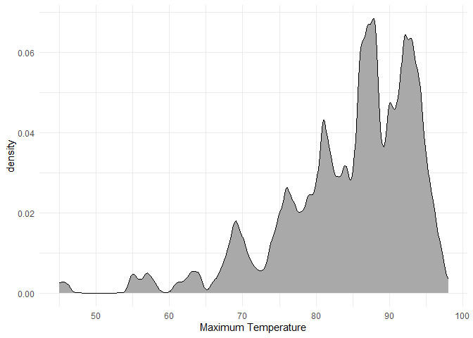

# Data Visualization Project 03

Using the dataset obtained from FSU's [Florida Climate Center](https://climatecenter.fsu.edu/climate-data-access-tools/downloadable-data), for a station at Tampa International Airport (TPA) for 2022, attempt to recreate the charts shown below which were generated using data from 2016. You can read the 2022 dataset using the code below: 


```r
library(tidyverse)
library(lubridate)
weather_tpa <- read_csv("https://raw.githubusercontent.com/reisanar/datasets/master/tpa_weather_2022.csv")
# random sample 
sample_n(weather_tpa, 4)
```

```
## # A tibble: 4 × 7
##    year month   day precipitation max_temp min_temp ave_temp
##   <dbl> <dbl> <dbl>         <dbl>    <dbl>    <dbl>    <dbl>
## 1  2022     5     7          0.15       87       74     80.5
## 2  2022    10     3          0          84       66     75  
## 3  2022     2     8          0.35       56       53     54.5
## 4  2022     1     3          0.02       75       55     65
```

```r
library(scales)

weather_tpa$month <- factor(month.abb[weather_tpa$month],
                            levels = month.abb)

color_func <- scales::gradient_n_pal(c("purple", "yellow"))
weather_tpa$temp_color <- color_func(rescale(weather_tpa$max_temp, to = c(0, 1)))
```

See https://www.reisanar.com/slides/relationships-models#10 for a reminder on how to use this type of dataset with the `lubridate` package for dates and times (example included in the slides uses data from 2016).

Using the 2022 data: 

(a) Create a plot like the one below:


```
## Warning: The `<scale>` argument of `guides()` cannot be `FALSE`. Use "none" instead as
## of ggplot2 3.3.4.
## This warning is displayed once every 8 hours.
## Call `lifecycle::last_lifecycle_warnings()` to see where this warning was
## generated.
```


Hint: the option `binwidth = 3` was used with the `geom_histogram()` function.

(b) Create a plot like the one below:



Hint: check the `kernel` parameter of the `geom_density()` function, and use `bw = 0.5`.

(c) Create a plot like the one below:


Hint: default options for `geom_density()` were used. 

(d) Generate a plot like the chart below:


```
## Warning: package 'ggridges' was built under R version 4.3.1
```

```
## Picking joint bandwidth of 6.58
```

```
## Warning: Using the `size` aesthetic with geom_segment was deprecated in ggplot2 3.4.0.
## ℹ Please use the `linewidth` aesthetic instead.
## This warning is displayed once every 8 hours.
## Call `lifecycle::last_lifecycle_warnings()` to see where this warning was
## generated.
```


Hint: use the`{ggridges}` package, and the `geom_density_ridges()` function paying close attention to the `quantile_lines` and `quantiles` parameters. The plot above uses the `plasma` option (color scale) for the _viridis_ palette.


(e) Create a plot of your choice that uses the attribute for precipitation _(values of -99.9 for temperature or -99.99 for precipitation represent missing data)_.


```r
weather_tpa %>%
  filter(precipitation != -99.99) %>%  # filter out missing data
  ggplot(aes(x = precipitation)) +
  geom_histogram(binwidth = 0.1, fill = "steelblue", color = "white") +
  labs(x = "Precipitation (in)", y = "Count") +
  theme_minimal()
```

<!-- -->
